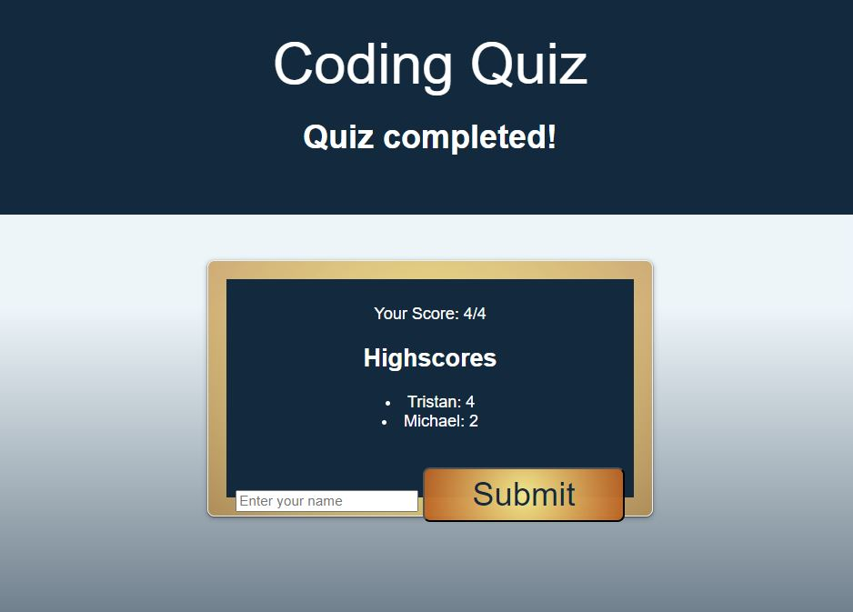

# Simple Coding Quiz

### [Description](#description) | [Features](#features) | [Images](#images) | [Links](#links) | [Setup](#setup) | [Usage](#usage) | [Credit](#credit) | [Contact](#contact)

## Description
This is a simple coding quiz to practice some simple coding questions 

## Features

- A start button that will start a timer that decreases for incorrect answers
- A highscore board to earn bragging rights
- Ability to save scores after refresh using local storage

## Images 

## Links
Link to deployed site

https://tristanm225.github.io/Code_Quiz/ 
 
## Setup
None

## Usage
A way to test your knowledge 

## Project Status
Project is: _complete_

## Room for Improvement

Room for improvement:
- Add a reset button so user does not need to refresh page
- Make the points system based on the amount of time taken instead of correct answers.

## Credit 
- Took all the CSS from the UCSD coding bootcamp week 4 mini project

## Contact
Created by TristanM225 Reach out to me by email! TristanM225@gmail.com